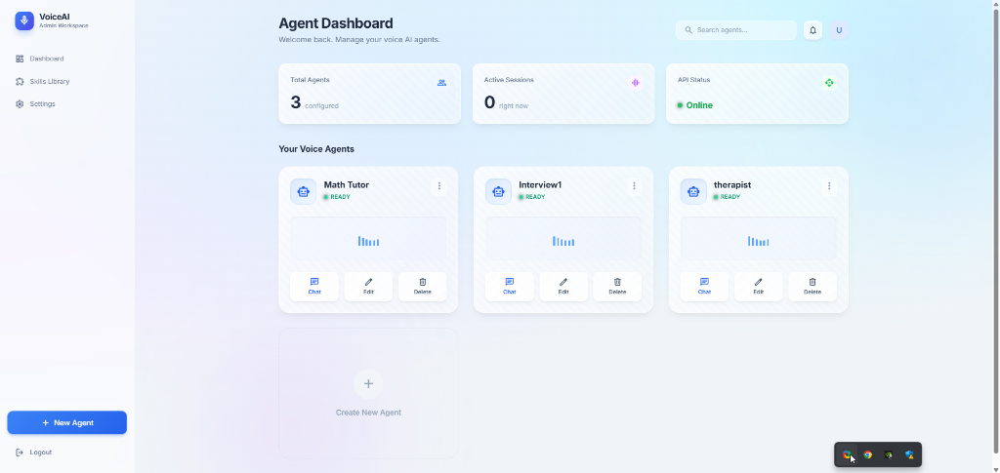
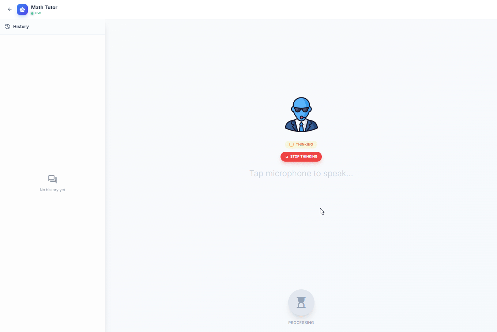

# VoiceAI Platform

A full-stack Voice AI application with a complete voice-to-voice pipeline.






## Features

- **Voice Pipeline**: User speaks → STT → LLM → TTS → Audio response
- **User Authentication**: JWT-based signup/login
- **Agent Management**: Create, edit, delete AI agents with custom system prompts
- **Provider Selection**: Configure STT, LLM, and TTS providers per agent
- **Real-time Captions**: Spotify-style word-by-word highlighting during playback
- **Modern UI**: Glassmorphism design with responsive layout
- **WebSocket Support**: Real-time voice interaction with streaming audio (Bonus Feature)
- **Streaming Audio**: Audio chunks streamed in 8KB segments for faster playback (Bonus Feature)

##  Architecture

```
┌─────────────┐     ┌─────────────┐     ┌─────────────┐
│   Frontend  │────▶│   Backend   │────▶│   MongoDB   │
│   (React)   │◀────│  (FastAPI)  │◀────│  (Database) │
└──────┬──────┘     └──────┬──────┘     └─────────────┘
       │                   │
       │ HTTP/WebSocket    │
       │                   │
       └───────────────────┘
              ┌────────────┼────────────┐
              ▼            ▼            ▼
        ┌─────────┐  ┌─────────┐  ┌─────────┐
        │   STT   │  │   LLM   │  │   TTS   │
        │  Groq   │  │  Groq   │  │ Eleven  │
        │ Whisper │  │ Llama   │  │  Labs   │
        └─────────┘  └─────────┘  └─────────┘
```

## 🎙️ Voice Interaction Modes

### HTTP Mode (Default)
- **Route**: `/voice/:agentId`
- **Method**: Standard HTTP POST
- **Response**: Complete audio as base64 JSON
- **Best for**: Simple request-response interactions

### WebSocket Mode (Bonus Feature)
- **Route**: `/voice-ws/:agentId`
- **Method**: WebSocket connection
- **Response**: Streaming audio in 8KB chunks
- **Best for**: Real-time interactions with faster response times
- **Features**:
  - Live connection status
  - Real-time status updates (Transcribing, Thinking, Synthesizing)
  - Progressive audio streaming
  - Lower latency

##  Prerequisites

- Python 3.10+
- Node.js 18+
- MongoDB (local or Atlas)
- API Keys:
  - Groq API Key (for STT & LLM) - [Get free key](https://console.groq.com/keys)
  - ElevenLabs API Key (for TTS) - Optional, Edge TTS is free default

##  Demo Account

For quick testing, use these credentials:

| Email | Password |
|-------|----------|
| `voice123@example.com` | `qwerty` |

##  Assumptions

- User has **Node.js 18+** and **Python 3.10+** installed
- **MongoDB** is accessible (local instance or MongoDB Atlas)
- **Microphone access** is granted in the browser
- Modern browser with **MediaRecorder API** support (Chrome, Edge, Firefox)
- For paid providers (Gemini, ElevenLabs), user provides their own API keys in `.env`
- Default configuration uses **free services only** (Groq + Edge TTS)

##  Quick Start

### 1. Clone the Repository

```bash
git clone <repository-url>
cd Voice_Platform
```

### 2. Backend Setup

```bash
cd backend

# Create virtual environment
python -m venv venv
venv\Scripts\activate  # Windows
# source venv/bin/activate  # Linux/Mac

# Install dependencies
pip install -r requirements.txt

# Configure environment
cp .env.example .env
# Edit .env with your API keys
```

**Environment Variables** (`.env`):
```env
MONGODB_URL=mongodb://localhost:27017
DATABASE_NAME=voice_platform
SECRET_KEY=your-secret-key-here
GROQ_API_KEY=your-groq-api-key
ELEVENLABS_API_KEY=your-elevenlabs-api-key
```

**Run Backend**:
```bash
uvicorn app.main:app --reload --port 8000
```

### 3. Frontend Setup

```bash
cd frontend

# Install dependencies
npm install

# Run development server
npm run dev
```

### 4. Access the Application

- **Frontend**: http://localhost:5173
- **Backend API**: http://localhost:8000
- **API Docs**: http://localhost:8000/docs

## 📁 Project Structure

```
Voice_Platform/
├── backend/
│   ├── app/
│   │   ├── main.py           # FastAPI application
│   │   ├── config.py         # Configuration settings
│   │   ├── database.py       # MongoDB connection
│   │   ├── models/           # Pydantic models
│   │   │   ├── user.py
│   │   │   └── agent.py
│   │   ├── routes/           # API endpoints
│   │   │   ├── auth.py       # Authentication
│   │   │   ├── agents.py     # Agent CRUD
│   │   │   └── voice.py      # Voice pipeline
│   │   ├── services/         # External API integrations
│   │   │   ├── stt.py        # Speech-to-Text
│   │   │   ├── llm.py        # Language Model
│   │   │   └── tts.py        # Text-to-Speech
│   │   └── utils/
│   │       └── auth.py       # JWT utilities
│   ├── requirements.txt
│   └── .env.example
│
├── frontend/
│   ├── src/
│   │   ├── pages/
│   │   │   ├── Login.tsx
│   │   │   ├── Signup.tsx
│   │   │   ├── Dashboard.tsx
│   │   │   ├── AgentForm.tsx
│   │   │   └── VoiceChat.tsx
│   │   ├── services/
│   │   │   └── api.ts
│   │   ├── utils/
│   │   │   └── audioRecorder.ts
│   │   ├── App.tsx
│   │   └── main.tsx
│   ├── index.html
│   └── package.json
│
└── README.md
```

## 🔌 API Endpoints

### Authentication
| Method | Endpoint | Description |
|--------|----------|-------------|
| POST | `/api/auth/signup` | Register new user |
| POST | `/api/auth/login` | Login, returns JWT |

### Agents
| Method | Endpoint | Description |
|--------|----------|-------------|
| GET | `/api/agents` | List user's agents |
| POST | `/api/agents` | Create new agent |
| GET | `/api/agents/{id}` | Get agent details |
| PUT | `/api/agents/{id}` | Update agent |
| DELETE | `/api/agents/{id}` | Delete agent |

### Voice
| Method | Endpoint | Description |
|--------|----------|-------------|
| POST | `/api/voice/chat` | Voice-to-voice pipeline |
| POST | `/api/voice/chat/text` | Voice-to-text (no TTS) |

##  UI Pages

1. **Login/Signup** - User authentication
2. **Dashboard** - Agent management with stats
3. **Agent Form** - Create/edit agents with provider selection
4. **Voice Chat** - Real-time voice interaction with captions

##  Configuration

### Supported Providers

**STT (Speech-to-Text)**:
- Groq Whisper (default, free tier)
- OpenAI Whisper
- Deepgram

**LLM (Language Model)**:
- Groq Llama 3.3 (default, free tier)
- OpenAI GPT-4
- Anthropic Claude

**TTS (Text-to-Speech)**:
- ElevenLabs (default)
- OpenAI TTS
- Azure Speech

##  Usage Flow

1. **Sign up** for an account
2. **Create an agent** with a custom system prompt
3. **Configure providers** (STT, LLM, TTS)
4. **Start voice chat** - hold the mic button to speak
5. **Receive audio response** with real-time captions

##  Development

### Backend Development
```bash
cd backend
uvicorn app.main:app --reload --port 8000
```

### Frontend Development
```bash
cd frontend
npm run dev
```

### Build for Production
```bash
# Frontend
cd frontend
npm run build

# Backend - use production ASGI server
pip install gunicorn
gunicorn app.main:app -w 4 -k uvicorn.workers.UvicornWorker
```

##  License

MIT License

##  Contributing

1. Fork the repository
2. Create a feature branch
3. Commit your changes
4. Push to the branch
5. Open a Pull Request
